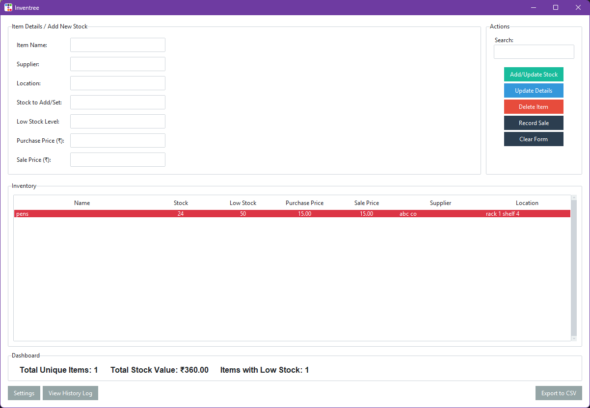

# Inventree 🌳

**A smart, modern, and user-friendly desktop inventory management tool for small businesses and shop owners.**

Inventree is an offline-first, standalone desktop application built with Python. It offers a comprehensive solution for inventory tracking, stock level management, and business insights. With a sleek themed interface and powerful backend logic, it simplifies and streamlines inventory operations.



---

## ✨ Key Features

Inventree goes beyond basic stock counting with a robust feature set designed for efficiency and control:

- **Full CRUD Operations**  
  Create, Read, Update, and Delete inventory items with ease.

- **Smart Stock Management**
  - **Add New Stock:** Seamlessly add stock to existing items.
  - **Weighted-Average Cost:** Automatically updates the average purchase price when adding stock at different costs.
  - **Record Sales:** Dedicated sales workflow that safely decreases stock levels.

- **Live Dashboard & Alerts**
  - **Dashboard Overview:** Displays total items, total stock value, and low-stock count.
  - **Low-Stock Highlighting:** Items at or below the low-stock threshold are marked in red.

- **Proactive Email Notifications**
  - Automatically sends email alerts when stock reaches critical or warning levels.
  - Credentials securely managed with a `.env` file.

- **Powerful Data Interaction**
  - **Real-Time Search:** Filter inventory live by item name, supplier, or location.
  - **Column Sorting:** Sort inventory data by any column, ascending or descending.

- **Complete Audit Trail**
  - **History Log:** Records all key actions — Create, Update, Delete, Sale, Stock Add.
  - **View History:** A dedicated window for reviewing past activity.

- **Data Management**
  - **Export to CSV:** Export the full inventory list for use in Excel or Google Sheets.
  - **Data Integrity Rules:** Enforces unique item names and mandatory fields like location and purchase price.

---

## 🛠️ Technology Stack

Inventree is built using a modern desktop development stack:

- **Language:** Python 3  
- **GUI Framework:** Tkinter with `ttkbootstrap` for modern themes  
- **Database:** SQLite 3 (local, file-based)  
- **Credential Management:** `python-dotenv` for secure environment variable handling  

---

## 🚀 Setup and Installation

To run Inventree locally, follow these steps:

### Prerequisites
- Python 3.6 or newer  
- `pip` (Python’s package installer)  

### 1. Clone or Download the Project

Download all project files (e.g., `main.py`, `database.py`) into a folder on your system.

### 2. Create a Virtual Environment (Recommended)

Open your terminal or command prompt in the project directory and run:

```bash
# Create the environment
python -m venv venv

# Activate it
# Windows:
venv\Scripts\activate
# macOS/Linux:
source venv/bin/activate
````

### 3. Install Dependencies

Install all required packages from `requirements.txt`:

```bash
pip install -r requirements.txt
```

### 4. Configure Email Notifications

Create a `.env` file in the project root and add your email credentials (Gmail App Password recommended):

```
INVENTREE_EMAIL_USER="your-service-email@gmail.com"
INVENTREE_EMAIL_PASS="your16digitapppassword"
```

### 5. Run the Application

Launch the app by running:

```bash
python main.py
```

---

## 📖 How to Use

1. **Configure Settings**
   Click “Settings” on first launch to set the alert recipient email.

2. **Add or Update Stock**
   Use the form to add new items or increase stock. Cost averaging is applied automatically.

3. **Record Sales**
   Select an item, click “Record Sale”, and enter the quantity sold.

4. **Edit Item Details**
   Select an item, make changes in the form, then click “Update Details”.

5. **View History Log**
   Click “View History Log” to review all past activity.

---

## 📄 License

Licensed under the MIT License. See the `LICENSE` file for details.
